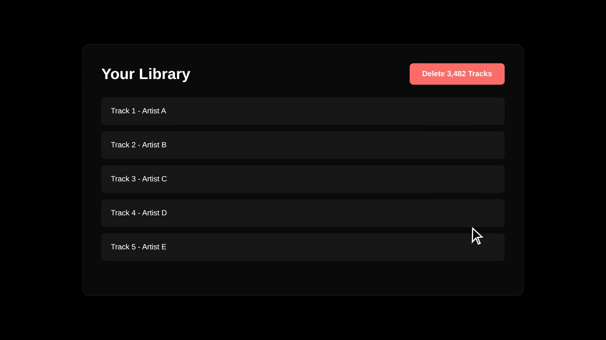

# SongNull

[](https://github.com/Zoroo2626/SongNull/blob/main/assets/BragVid.mp4)

I had a few thousand old songs cluttering my Spotify library from 2018, and I couldnt bring myself to click the heart icon on every single one of them to clean it up. The official app doesnt let you bulk delete.

So I built SongNull. Local first dashboard to search, select, and batch delete (or restore) tracks. 

It runs in your browser using the official API. Theres no backend, and your data stays with you.

## Getting started

You need a Spotify Developer account to run this locally. 

1. Create an app on the [Spotify Developer Dashboard](https://developer.spotify.com/dashboard).
2. Add `http://localhost:5173/callback` as a Redirect URI.
3. Grab the Client ID.

Clone the repo and install the packages:

```bash
npm install
```

Create a `.env.local` file in the root. Drop your credentials in:

```text
VITE_SPOTIFY_CLIENT_ID=your_client_id_here
VITE_REDIRECT_URI=http://localhost:5173/callback
```

Start the dev server:

```bash
npm run dev
```

Open `http://localhost:5173` and log in.

## Architecture 

Spotifys API caps track deletions at 40 (or 100 for playlists) per request. If you highlight 500 songs in SongNull and hit delete, the app silently chunks them into optimal batches and fires them off sequentially. 

It uses the PKCE authorization flow. This means you authenticate directly with Spotify through the browser, skipping the need for a backend server to guard a client secret. Everything stays client-side.
